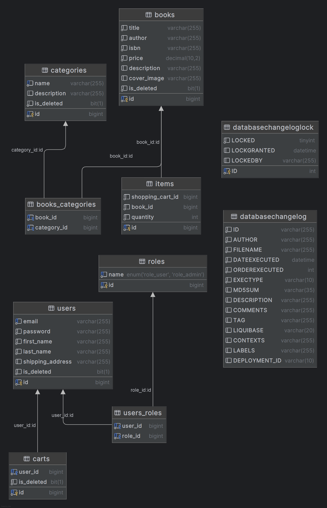

## Bookstore API

### 📖 Intro
Welcome to Bookstore — a learning project I created to put into practice all the technologies I've studied in the Java ecosystem, while also enjoying the development process.
The goal is simple: to combine theory with hands-on experience, master Spring Boot, and build a fully functional online store from scratch.
The project is built using Java and Spring Boot.
It includes all the key components typical of a modern web application, with a focus on e-commerce functionality.
Let me walk you through how it all works!
---
### 📡 Tech stack
- Java 17
- Spring Boot 3.4.2
- Spring Data JPA 3.4.2
- Spring Security 6.4.3
- MySql 8.0.33
- Docker 3.4.1
- JUnit 4.13.2
- Swagger 5.20.1
---
### 📎 Functionality
1. User Registration, Authentication & Authorization:
    - New users can register (`POST /auth/registration`) and log in (`POST /auth/login`) to the system.
    - Upon successful login, a JWT token is issued for further authenticated requests.
    - Role-based access control is implemented: **USER** (customer) and **ADMIN**.
    - All incoming data for registration and login is validated using Hibernate Validator.
2. Book Management (CRUD & Search):
    - **Admin** can manage books in the system: create (`POST /books`), update (`PUT /books/{id}`), and delete (`DELETE /books/{id}`).
    - **User** can: view the complete book list (`GET /books`), search books with filters (`GET /search`), view individual book details by ID (`GET /books/{id}`).
3. Category Management (CRUD & Lookup):
    - **Admin** can perform all CRUD operations on categories: create and retrieve categories (`POST /categories, GET /categories`), update and delete them by ID (`PUT, DELETE /categories/{id}`).
    - **User** is able to browse all categories, retrieve a single category by ID (`GET /categories/{id}`), get a list of books under a specific category (`GET /categories/{id}/books`).
4. Shopping Cart:
    - A shopping cart is automatically assigned to each user upon successful registration.
    - **Users** can: view their cart (`GET /cart`), add items to it by book ID and quantity (`POST /cart`), update quantity of items (`PUT /cart/items/{id}`), remove items from the cart (`DELETE /cart/items/{id}`).
5. Order Functionality:
    - **Users** can:
      - View all of their orders (`GET /orders`).
      - Place a new order using their current cart and shipping address (`POST /orders`).
      - Retrieve details of a specific order (`GET /orders/{orderId}/items`).
      - Get detailed information about an order item (`GET /orders/{orderId}/items/{orderItemId}`).
    - **Admin** is able to modify/update order status, (e.g., from "Order placed" to "Processing") using (`PUT /orders/{id}`).
---
### 📚 UML Diagram

---
### 🔩 Installation
- Install:
    - Java 17
    - Maven
    - MySQL
    - Docker
- Clone the repository: https://github.com/Oleg021/online-book-shop.git
- Create an env file (a template is provided, see "env.template" file)
- Run the following commands:
```
mvn clean install
docker-compose build
docker compose up
```
You can see and try all the functions (and models) by activating the project and going to http://localhost:8080/swagger-ui.html (check the port are you working with) by these credentials:
```
    email: admin@email.com
    password: 1234
```
---
### 🧪 [Postman collection for testing](https://oleh-97197.postman.co/workspace/Oleh's-Workspace~0f65e419-89a9-41e6-8a3f-26f2fcc42068/collection/44745715-beb68472-4d89-4341-ad8c-15dac181f289?action=share&creator=44745715)
---
---
### 📊 Running Tests
To run tests, run the following command

```bash
  mvn test
```
---
### 💪 Challenges faced
- Setup of Docker with existing MySQL DB running inside the container ✅
- Implementing pagination for book search ✅
- Testing controllers classes ✅
